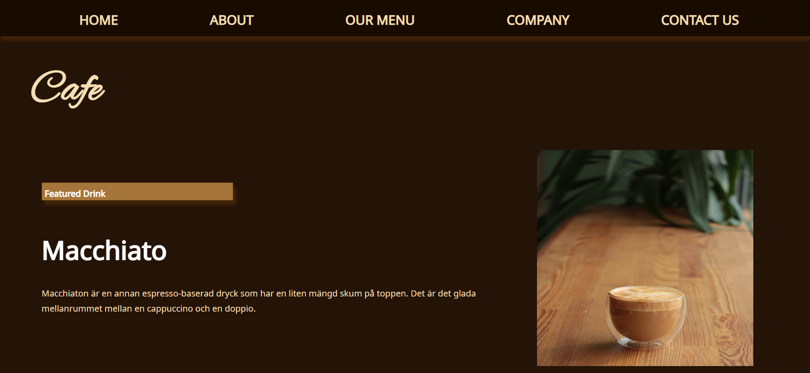
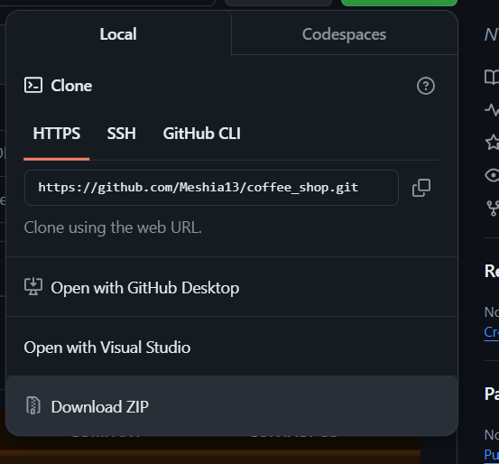

# Cafe Coffee Shop

## Table of contents

- [Overview](#overview)
  - [Description](#description)
  - [Demo](#demo)
  - [Built with](#built-with)
  - [Installation](#installation)
  - [Open Source](#open-source)
- [Author](#author)

## Overview

### Description

One page website application for a coffee shop. This web application demonstrates how to fetch API's, proper HTML semantic, proper indentation, consistent styling, and clean code structure.

### Demo

- Live Site URL: [Live Code](https://meshia13.github.io/coffee_shop/assets/misc/demo.gif)

## My process

### Built with

- Semantic HTML5 markup
- CSS custom properties
- Flexbox
- CSS Grid
- JavaScript
- Document Object Model (DOM)
- API: [SampleAPIs](https://sampleapis.com/api-list/coffee)

### Installation
#### To get a local copy up:

### Open Source
#### How to contribute to open source

- [How to Contribute to Open Source Projects – A Beginner's Guide](https://www.freecodecamp.org/news/how-to-contribute-to-open-source-projects-beginners-guide/)

## Author

- GitHub - [Meshia13](https://github.com/Meshia13)

